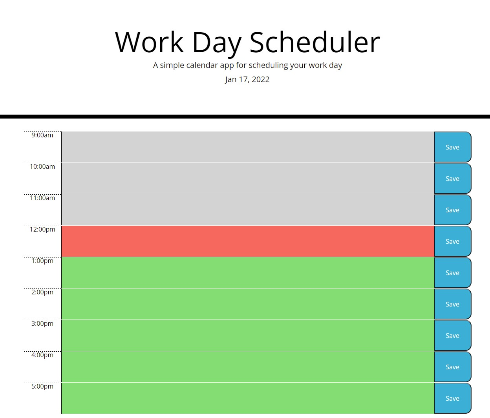

# Work Day Scheduler Starter Code

## Description

This is my fifth challenge for the UofU bootcamp.  In it you will find a schudluler that you can input text into it by clicking on box to help plan your day.  It will save your responses so even if you refresh your text will stay.  The current hour will be highlighted in red with future hours being highlighted green and hours that have past being grey.   

## What I Learned

Yet again a little bit of everything and a little bit of nothing.  As my third JavaScript project I found this to still be a huge challenge.  The biggest issue this go around was meeting jquery while still feeling like I never really had enough time with plain old JavaScript. As always I will keep pushing forward in an attempt to grow and improve.

https://johnknee3.github.io/Work-Day-Scheduler/

 